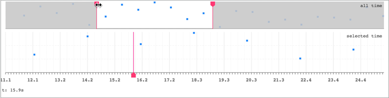
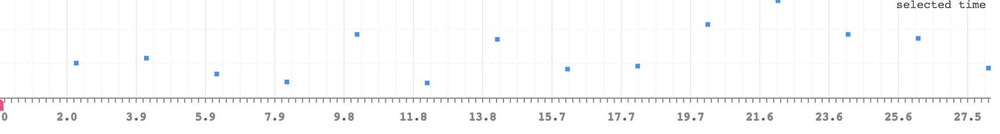
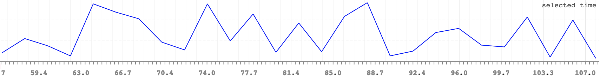

# snabbdom-timeline

an interactive timeline component implemented in snabbdom




## features
* can stack multiple graphs
* single time or ranged time selectors
* data oriented, functional design
* tiny! (~ 400 lines of code)
* renders with SVG or canvas


## usage

requires node >= v12.17 or a browser that supports the es module format.


via `npm`:
```javascript
import html     from 'snabby'
import timeline from 'snabbdom-timeline'
```

via a pure es module (browser or `deno`):
```javascript
import html     from 'https://cdn.jsdelivr.net/npm/snabby@2/snabby.js'
import timeline from 'https://cdn.jsdelivr.net/gh/mreinstein/snabbdom-timeline/timeline.js'
```


```javascript

// contains all data needed to render a timeline component

const model = {
    container: document.createElement('div'),
    width: 0,
    renderer: 'svg', // canvas | svg
    graphs: [
        {
            title: 'test title',
            label: 'title',
            type: 'scatterPlot',  // scatterPlot | linePlot
            timeRange: {
                start: 0,  // seconds
                end: 0     // seconds
            },
            yRange: {
                start: 0,
                end: 100
            },

            // optional: render a selection control
            selection: {
                type: 'range',
                start: 0,       // seconds | 0
                end: Infinity,  // seconds | Infinity
                dragging: false
            },

            height: 40,              // pixels
            dataColor: 'dodgerblue', // color of data points on the graph
            renderTicks: false,
            renderValueLabel: false,

            // the data points to render
            data: [ ],

            // optional: settings for grid background lines
            gridLines: {
                vertical: {
                    majorColor: '#dedede',
                    minorColor: '#f3f3f3',
                    ticksPerMinor: 2.5,
                    ticksPerMajor: 10
                },
                horizontal: {
                    color: '#eeeeee',
                    lineCount: 2
                }
            }
        }
    ]
}


document.body.appendChild(model.container)


function update () {
    const oldVnode = model.container
    const newVnode = timeline(model, update)
    model.container = html.update(oldVnode, newVnode)
}


// pump test data into the graph
setInterval(function () {
    const value = model.graphs[0].yRange.start + Math.round(Math.random() * (model.graphs[0].yRange.end - model.graphs[0].yRange.start))
    model.graphs[0].data.push({
        t: performance.now() / 1000,
        value
    })

    update()
}, 2000)

update()

```

## graph types

There are 2 available graph types:

### scatterPlot




### linePlot




You can also open `example.html` in a browser to see a more complicated example with 2 graphs linked together.


## renderer option

by default, snabbdom-timeline will use `svg` to render these graphs. These are nice in that they are semantic elements, and are probably more accesible.

However, if you're rendering a _lot_ of graphs with frequently updating data, you may find the svg based rendering performance is insufficient.

For example, in one of my projects I'm
rendering 50 of these graphs, with new data coming in at 60 frames per second, and storing 1,000 data points per graph. Using virtual dom really bogs things down at this scale,
so in that case I use the `canvas` renderer option which has much better performance, at the cost of blurrier text and less semantically friendly markup.
