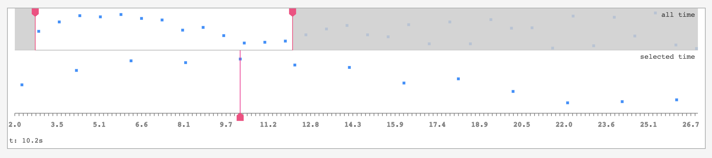

# snabbdom-timeline

an interactive timeline component implemented in snabbdom




## features
* can stack multiple graphs
* single time or ranged time selectors
* data oriented, functional design
* tiny! (< 300 lines of code)
* renders with SVG


## example usage

```javascript
import html     from 'https://cdn.jsdelivr.net/npm/snabby@1/snabby.js'
import timeline from 'https://cdn.jsdelivr.net/gh/mreinstein/snabbdom-timeline/timeline.js'


// contains all data needed to render a timeline component

const model = {
    container: document.createElement('div'),
    width: 0,
    graphs: [
        {
            title: 'test title',
            label: 'title',
            type: 'scatterPlot',
            timeRange: {
                start: 0,  // seconds
                end: 0     // seconds
            },
            yRange: {
                start: 0,
                end: 100
            },
            selection: {
                type: 'range',
                start: 0,         // seconds | 0
                end: Infinity,    // seconds | Infinity
                dragging: false
            },
            height: 40,           // pixels
            dataColor: 'dodgerblue',
            renderTicks: false,
            renderValueLabel: false,
            data: [ ]
        }
    ]
}


document.body.appendChild(model.container)


function update () {
    const oldVnode = model.container
    const newVnode = timeline(model, update)
    model.container = html.update(oldVnode, newVnode)
}


// pump test data into the graph
setInterval(function () {
    const value = model.graphs[0].yRange.start + Math.round(Math.random() * (model.graphs[0].yRange.end - model.graphs[0].yRange.start))
    model.graphs[0].data.push({
        t: performance.now() / 1000,
        value
    })

    update()
}, 2000)

update()

```

You can also open `example.html` in a browser to see a more complicated example with 2 graphs linked together.
